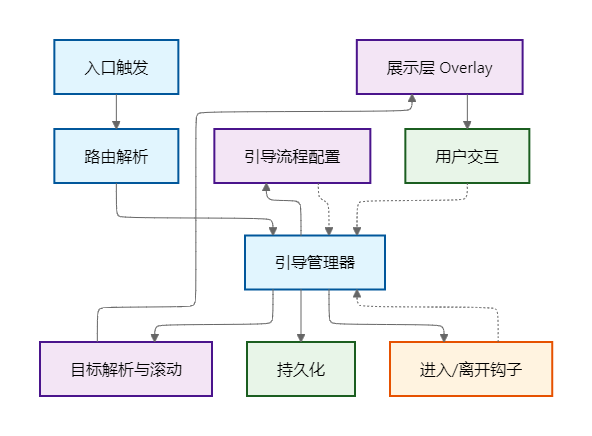
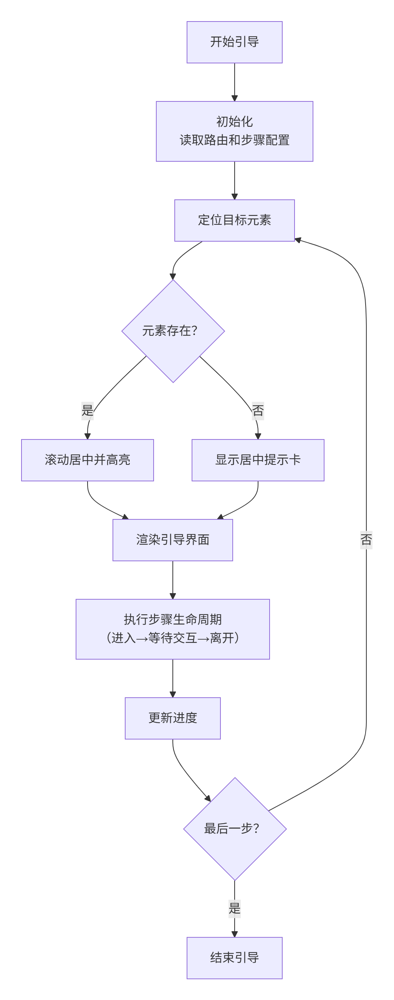

# 新手引导系统开发手册


## 引导系统架构
系统由四部分协作完成：
- 触发与集成：页面按钮或 URL 参数触发引导，路由变化后自动判断是否需要启动。
- 引导管理器：负责流程状态（当前步骤、是否调试、是否持久化）、前进/后退/结束、为每一步查找目标元素并滚动到合适位置。
- 引导流程配置：按页面（如首页、活动列表、活动详情）维护步骤清单，包含每一步的标题、文案、定位方式、条件判断以及进入/离开时需要做的动作。
- 展示层（Overlay）：在页面上画出遮罩与高亮，显示提示卡片，并处理键盘/点击等交互。

数据流：入口触发 → 管理器读取对应流程 → 为当前步骤定位目标 → 展示层渲染高亮与提示 → 用户操作推进步骤 → 管理器更新状态并（可选）写入本地存储 → 流程完成并关闭。

## 模块划分
- 引导管理器：统一处理状态与动作。提供启动、停止、下一步、上一步等方法；在进入/离开某一步时执行钩子；通过稳健的定位策略拿到目标元素并滚动到可见区域。
- 展示层（Overlay）：让当前步骤“看得见”。绘制遮罩与高亮，摆放提示卡，并在滚动或窗口变化时重新计算位置；目标缺失时把提示卡居中显示，保证流程不中断。
- 引导流程配置：用纯数据描述每一步（标题、说明、选择器或候选选择器、条件判断、进入/离开动作），按路由名组织，便于复用与维护。
- 路由与触发：通过路由守卫读取 URL 参数（guide、debug、resume）或页面入口按钮启动；如开启持久化，会在本地保存进度，支持恢复。

## 关键难点与方案
- 元素定位容易失效：结构微调或不同权限下元素不可见会导致选择器失准。
方案：在关键节点使用 `data-guide`，同一步可配置候选选择器数组；仍找不到时，引导卡片居中显示说明，让用户继续。
- 提示卡位置容易“出屏”或遮挡内容：不同分辨率或滚动状态下绝对定位不可靠。
方案：基于视口坐标计算目标外框，优先把提示卡放在下方；空间不足时改为上方，并对左右边界进行夹紧；滚动和窗口变化时触发重算。
- 权限与数据差异：一些按钮只有在特定模式或状态下出现，或列表为空。
方案：为每一步提供条件判断与进入/离开钩子，用来自动切换必要状态（如进入编辑、展开面板）；条件不满足时跳过该步或给出替代说明。
- 进度持久化与恢复：用户中途离开或刷新不希望从头再来。
方案：在本地存储中记录每个流程的当前步骤与完成标记；按需要选择是否恢复上次进度。
- 稳定性与性能：引导仅在激活时挂载键盘、滚动、resize 监听，关闭后清理；展示层计算简单、渲染轻量，不影响页面性能。

这套设计强调入口可控、定位稳健、展示可靠、对差异友好。对开发者而言，接入成本低、维护集中，页面调整后也能尽量保持可用。

## 架构图

- 入口触发（页面按钮/URL 参数） → 路由解析（afterEach 读取 guide/debug/resume）
- 路由解析 → 引导管理器（维护状态：当前步骤、调试、持久化、是否激活）
- 引导管理器 ↔ 引导流程配置（按路由名读取步骤清单）
- 引导管理器 → 目标解析与滚动（候选选择器；优先 data-guide；滚动居中）
- 目标解析与滚动 → 展示层 Overlay（遮罩、高亮、提示卡定位）
- 展示层 Overlay → 用户交互（下一步/上一步/跳过/键盘）
- 用户交互 → 引导管理器（推进/回退、执行进入/离开钩子）
- 引导管理器 → 持久化（localStorage 记录进度与完成；可恢复）

## 流程图
- 流程步骤：
  1. 用户点击入口或使用 URL 参数触发
  2. 读取当前路由与参数（guide/debug/resume）
  3. 选择并载入该路由对应的流程步骤清单
  4. 设置当前步骤索引（可从本地存储恢复）
  5. 解析选择器：按候选数组依次查找，优先命中 data-guide
  6. 找到目标则滚动居中；找不到则启用居中提示卡回退
  7. 展示层渲染：遮罩+高亮；提示卡位置下方优先，上方兜底，左右边界夹紧
  8. 执行进入钩子（onEnter），例如切换到编辑模式、展开面板
  9. 等待用户交互：下一步/上一步/跳过（支持键盘快捷键）
  10. 执行离开钩子（onLeave），例如退出编辑或收起面板
  11. 更新步骤索引，并在开启持久化时写入本地进度
  12. 判断是否为最后一步：
      - 是 → 记录完成标记、关闭 Overlay、结束流程
      - 否 → 返回第 5 步，进入下一次循环



## 关键接口说明

### 引导管理器

#### 状态属性
```typescript
active: boolean          // 是否激活状态
flowId: string | null    // 当前流程ID  
steps: Step[]           // 步骤配置数组
index: number           // 当前步骤索引
debug: boolean          // 调试模式
persist: boolean        // 持久化开关
```

#### 方法接口

**start(flowId: string, options?: StartOptions): void**
- 参数：
  - `flowId` - 流程标识符
  - `options` - 启动选项
    - `debug?: boolean` - 调试模式
    - `persist?: boolean` - 持久化进度  
    - `resume?: boolean` - 恢复上次进度

**next(): void / prev(): void**
- 下一步/上一步导航
- 执行生命周期钩子并更新索引

**stop(): void**
- 停止引导流程
- 最后一步会标记完成状态

**getTarget(): { el: HTMLElement | null, step: Step }**
- 解析选择器获取目标元素，支持选择器数组与 `data-guide` 优先级

**go(index: number): void**
- 跳转到指定步骤，执行进入/离开钩子并滚动居中

**resolve(selector: string | string[]): HTMLElement | null**
- 解析并返回选择器对应的元素，用于调试面板命中状态判定

## 数据结构

### 步骤
```typescript
interface Step {
  title: string;                    // 步骤标题
  content: string;                  // 描述内容
  selector: string | string[];      // 目标元素选择器
  hints?: string[];                 // 语义提示词（AI 兜底定位使用）
  guard?: boolean | (() => boolean); // 守卫条件
  onEnter?: () => void;             // 进入回调
  onLeave?: () => void;             // 离开回调
}
```

### 流程
- 按路由名组织：`home`, `activities`, `activity-detail`
- 结构：`Record<string, Step[]>`

## 触发机制

### URL 参数
- `?guide=1` - 启动当前路由引导
- `?guide=<flowId>` - 指定流程启动  
- `&debug=1` - 开启调试模式
- `&resume=1` - 恢复上次进度

### 页面快捷方式（开发者入口）
- `Ctrl+Shift+G`：为当前路由启动引导（开启调试，自动恢复进度）
- `Ctrl+Shift+D`：在引导激活时切换调试面板显示/隐藏
- 页面按钮：在全局头部点击“开发者模式”按钮，若引导未激活则启动并开启调试；已激活则切换调试面板显示/隐藏。

### 编程触发
```javascript
// 页面入口调用
GuideManager.start($route.name, { persist: true });
```

## 展示层规范

### 渲染规则
- **遮罩高亮**：基于视口坐标计算
- **提示卡定位**：
  - 默认：目标元素下方
  - 兜底：空间不足时上方显示
  - 回退：目标缺失时居中显示

### 键盘快捷键
- `Escape` - 跳过引导
- `ArrowRight` - 下一步
- `ArrowLeft` - 上一步

### 调试模式（可视化）
- 开启方式：`start(flowId, { debug: true })` 或 URL 加 `&debug=1`
- 面板内容：步骤序号、标题、选择器（数组合并显示）、命中状态
- 交互能力：点击任一步快速跳转（基于 `go(index)`）；用于页面结构变化后的快速自检与校正
- 面板拖动：在面板标题区域按住拖动，可在视口内任意移动，避免遮挡页面元素

### AI 语义兜底
- 当 `selector` 未命中时，系统会基于 `title/content/hints` 在交互元素（如 `button/a/role=button/aria-label`）中进行语义匹配，优先包含提示词的可见元素；若仍未命中则回退为居中提示卡。
- 通过 `hints` 提供常用同义词或界面词（如“保存/提交/更新”“上一张/下一张/切换”），能显著提升在小改动下的自动兼容能力。


## 持久化方案

### 存储键
- 进度：`guide:progress:<flowId>` (存储索引)
- 完成标记：`guide:completed:<flowId>` (存储 '1')

### 恢复逻辑
- 仅在 `resume=true` 时恢复进度
- 验证索引有效性后跳转到对应步骤

## 边界约束

1. **流程验证**：`flowId` 不存在时不启动
2. **元素定位**：选择器未命中时采用居中回退
3. **进度保护**：恢复时验证索引范围有效性
4. **完成标记**：仅最后一步正常完成时记录
